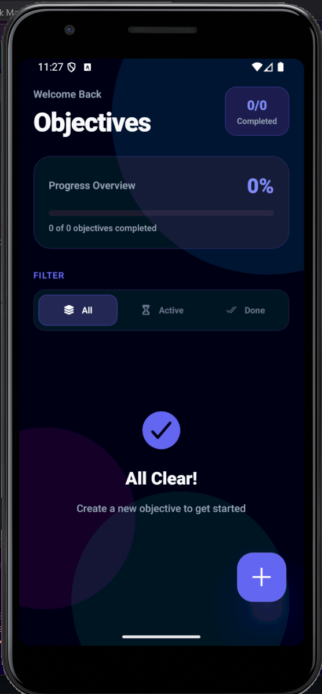

# 🌌 Cyber-Task Master  

<p align="center">
  
</p>

## 📌 Project Summary  

Cyber-Task Master is a high-performance task management application built using **React Native (Expo)** with a focus on:

- Smooth native animations (60fps)
- Offline-first architecture
- Persistent local storage
- Production-ready Android build (EAS)

This project demonstrates practical experience in mobile UI engineering, state management, local persistence, and performance optimization.

---

## 🚀 Live Capabilities  

### 1️⃣ Advanced UI System (Cyber-Glass Design)
- Layered semi-transparent components
- Blur and glow-based visual hierarchy
- Responsive layout across device sizes
- Controlled re-renders for performance stability

### 2️⃣ 3D Parallax Animation Engine
- Multi-layer animated background
- Navigation-aware motion interpolation
- Native-driven animations using `Animated API`
- Optimized to maintain consistent frame rate

### 3️⃣ Offline-First Data Persistence
- Integrated `@react-native-async-storage/async-storage`
- Automatic hydration on app launch
- Resilient against app restarts and background termination
- No backend dependency

### 4️⃣ Real-Time Productivity Metrics
- Dynamic progress calculation
- Instant UI updates on state change
- Efficiency score computed from task completion ratio
- No redundant re-renders

### 5️⃣ Production Deployment
- Built using Expo Application Services (EAS)
- Standalone Android APK
- Tested build pipeline and release workflow

---

## 🛠️ Tech Stack  

| Layer | Technology |
|-------|------------|
| Mobile Framework | React Native |
| Runtime | Expo |
| Navigation | React Navigation (Native Stack) |
| Storage | AsyncStorage |
| Animations | React Native Animated API |
| Icons | Expo Vector Icons (Ionicons) |
| Build System | EAS Build |

---

## 🧠 Engineering Decisions  

### Why AsyncStorage?
- Lightweight
- No backend overhead
- Suitable for single-device persistence
- Faster development cycle for MVP deployment

### Why Animated API instead of heavy libraries?
- Lower dependency footprint
- Native driver support
- Better performance control
- Avoids unnecessary abstraction layers

### Why Offline-First?
- Improves reliability
- Works without network
- Reduces architectural complexity for a task manager use-case

---

## 📦 Installation & Setup  

### Clone Repository  

```bash
git clone https://github.com/YOUR_USERNAME/Cyber-Task-Master.git
cd Cyber-Task-Master
```

### Install Dependencies
```bash
npm install
```

### Start the Development Server
```bash
npx expo start
```

